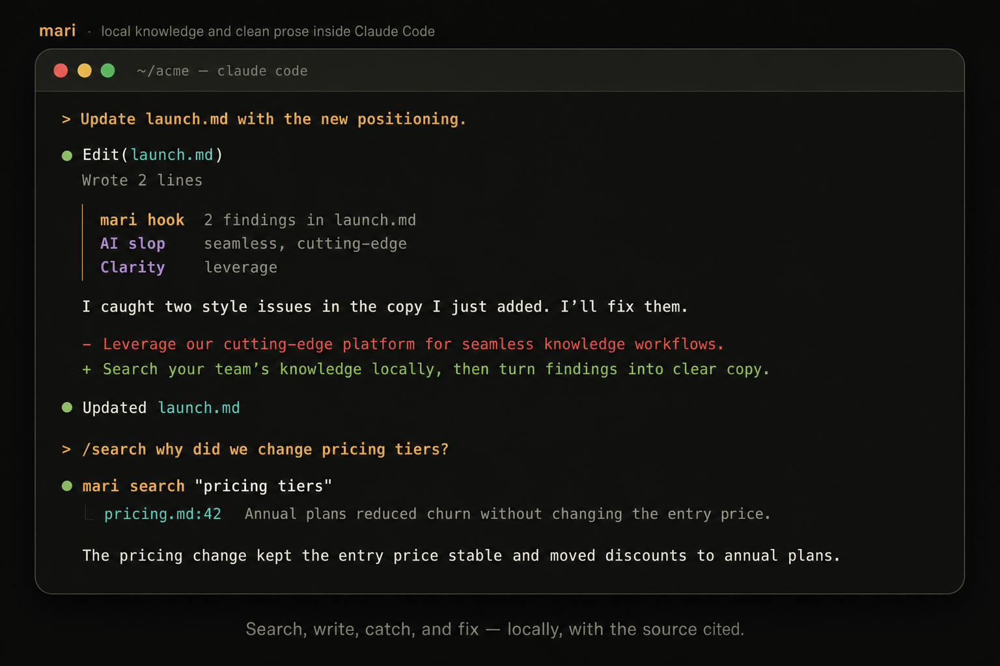
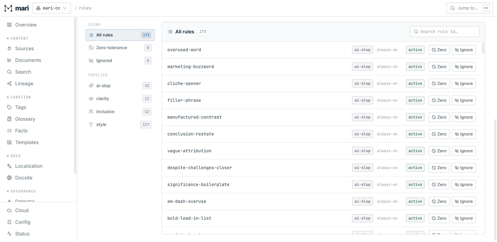

# Mari

[](https://github.com/MariHQ/mari-cc)
[](https://github.com/MariHQ/mari-cc/releases)
[](#rules-not-vibes)
[](#local-by-default)
[](#local-by-default)
[](LICENSE)


```sh
/plugin marketplace add MariHQ/mari-cc
/plugin install mari@mari
```

Mari is an AI prose manager for Claude Code. It catches weak writing as Claude
edits, rewrites it in your project's voice, and enforces your house style.

The detector is deterministic and runs locally. It flags concrete passages and
named rules instead of guessing whether text "sounds AI-written." Then Claude handles
the rewrite.



## Manage AI-written prose

- **Catch problems after every edit.** The Claude Code hook checks new prose for
  AI slop, unclear language, grammar, inclusive language, and house-style
  violations while the writing is still in context.
- **Rewrite with editorial intent.** Use `/deslop`, `/tighten`, `/clarify`,
  `/sharpen`, `/understate`, `/critique`, and `/polish` instead of asking for a
  vague "make this better" pass.
- **Enforce your voice.** Choose Microsoft, Google, AP, Chicago, or plain style.
  Add project terminology and forbidden phrasing, then configure waivers and
  zero-tolerance rules.
- **Keep documentation current.** Edit-notify rules, doc↔code lineage,
  localization checks, and nudges tell Claude what else must change with an
  edit.
- **Find supporting context.** Local search can pull evidence from connected
  team sources when the prose needs grounding. Search supports the writing
  workflow. You can use every prose tool without it.

## Rules

Mari's 170+ deterministic rules identify the passage, the problem, and the
applicable style guidance. The Rules console shows the complete catalog,
project waivers, zero-tolerance rules, and edit-notify rules in one place.



## Localization

Mari recognizes common documentation layouts, including `README.es.md`,
language directories such as `docs/{en,fr}/`, Hugo's `content.zh`, and
Docusaurus `i18n/<lang>/...` trees.

Ask Claude "Are the translations in sync?" to run the conformance workflow.
For a repository-wide check, use `/mari i18n conform docs`. Add `--deep --limit
5` when you also want semantic coverage reviewed.

## Local by default

The prose detector doesn't call a model. Optional knowledge search and deep
grounding use two small local models, downloaded on first use into
`~/.mari/models`:

- **Embeddings:** `Qwen3-Embedding-0.6B` (Apache-2.0), ~640 MB.
- **Attention** (deep grounding/coverage/focus, opt-in via `--deep`):
  `Qwen3.5-0.8B` (Apache-2.0), ~520 MB.

All documents and indexes remain on your machine, along with the models and
credentials. The command-line interface (CLI) makes no external large language
model (LLM) calls. Optional optical character recognition (OCR) for scanned PDFs
is off by default. See `SECURITY.md` before enabling it.

## License

MIT. See `LICENSE`. Bundled models carry their own permissive licenses
(Qwen: Apache-2.0; Unlimited-OCR: MIT).
